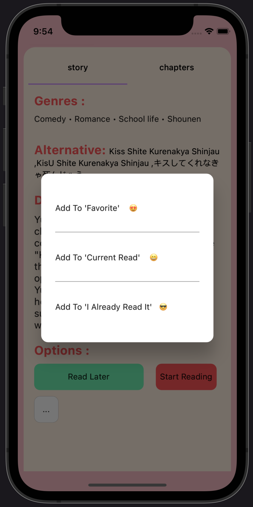

# MangaGo

MangaGo is a dynamic manga app built using the Flutter 3 framework, incorporating advanced web scraping techniques to provide a seamless manga reading experience. If you find this project inspiring and wish to motivate me to pursue more innovative projects like this, kindly consider giving a star to this repository and sharing it with your fellow manga enthusiasts.

## Screenshots

<!-- Screenshot 1 -->

<!-- Screenshot 2 -->

<!-- Screenshot 3 -->

<!-- Screenshot 4 -->

<!-- Screenshot 5 -->

<!-- Screenshot 6 -->

<!-- Screenshot 7 -->

